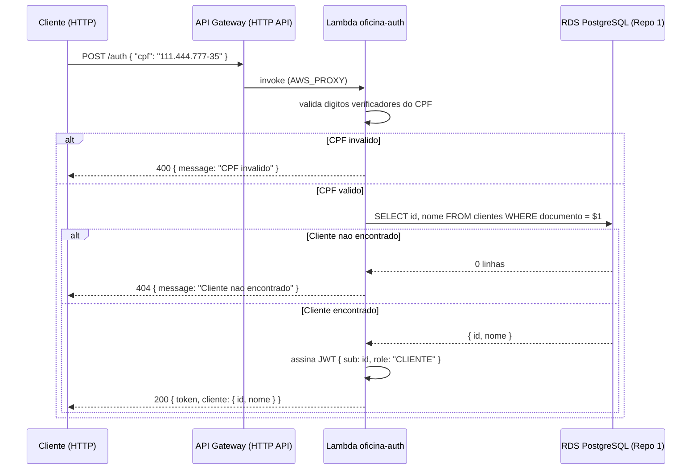

# oficina-lambda-auth

Função serverless (AWS Lambda + API Gateway) para autenticação de clientes do
projeto **oficina** via CPF. Este é o **Repositório 2** da Fase 3 do Tech
Challenge, dentro da arquitetura de 4 repositórios independentes:

| # | Repositório | Responsabilidade |
|---|---|---|
| 1 | oficina-db-infrastructure | Banco de dados gerenciado (RDS PostgreSQL) |
| 2 | **oficina-lambda-auth** (este) | Lambda de autenticação por CPF + API Gateway |
| 3 | oficina-app | Aplicação NestJS (Clean Architecture/DDD) |
| 4 | oficina-k8s-infrastructure | Cluster Kubernetes (compute) na nuvem |

## Sumário

- [Propósito](#propósito)
- [Tecnologias](#tecnologias)
- [Fluxo de autenticação](#fluxo-de-autenticação)
- [Decisões de arquitetura](#decisões-de-arquitetura)
- [Schema consumido](#schema-consumido)
- [Pré-requisitos](#pré-requisitos)
- [Execução local](#execução-local)
- [Deploy](#deploy)
- [Exemplo de uso (cURL)](#exemplo-de-uso-curl)
- [Variáveis](#variáveis)
- [Integração pendente com o Repositório 3](#integração-pendente-com-o-repositório-3)

## Propósito

Receber um CPF via HTTP, validar seus dígitos verificadores, consultar se o
cliente existe no banco RDS PostgreSQL (provisionado no
[Repositório 1](../oficina-db-infrastructure)) e, se encontrado, emitir um
token JWT assinado contendo o `id` do cliente e a role `CLIENTE`, para
consumo pelas rotas protegidas da API principal (Repositório 3).

## Tecnologias

| Ferramenta | Versão |
|---|---|
| Node.js | 20.x |
| TypeScript | ^5.6 |
| esbuild | ^0.24 (empacotamento do zip da Lambda) |
| jsonwebtoken | ^9.0 |
| pg (node-postgres) | ^8.13 |
| Terraform | >= 1.6.0 |
| Provider `hashicorp/aws` | ~> 5.0 |
| AWS API Gateway | HTTP API (v2) |
| AWS Lambda | Runtime `nodejs20.x` |

## Fluxo de autenticação



## Decisões de arquitetura

- **Credenciais injetadas no deploy, não lidas em runtime**: o Terraform (que
  roda no GitHub Actions ou localmente, **fora** da VPC privada) lê as
  credenciais do RDS e as injeta diretamente como variáveis de ambiente da
  Lambda. A função **não** chama a API do Secrets Manager/SSM durante a
  execução. Isso evita a necessidade de um NAT Gateway (~US$32+/mês) ou VPC
  Interface Endpoint (~US$7-15/mês) para a Lambda alcançar APIs da AWS de
  dentro da VPC privada — nenhum dos dois é coberto pelo free tier. A troca:
  rotacionar a senha do banco exige um novo `terraform apply` neste repositório.
- **AWS Secrets Manager**: mesmo com a injeção em deploy-time, um segredo é
  criado no Secrets Manager (`terraform/secrets.tf`) espelhando as credenciais
  do RDS, para atender ao padrão de auditabilidade/rotação pedido no
  enunciado da Sprint 2. Isso reintroduz o custo fixo (~US$0.40/mês) que o
  Repositório 1 evita usando SSM Parameter Store — decisão consciente e
  isolada a este repositório.
- **Rede compartilhada com o Repositório 1**: a Lambda entra na **mesma
  VPC/subnets privadas** do RDS (lidas via `terraform_remote_state` do state
  do Repositório 1), com um Security Group próprio cuja única regra de
  egress libera a porta 5432 em direção ao Security Group do RDS (referência
  por ID, não CIDR). Isso substitui, com mais precisão, a regra
  `auth_lambda_cidr_blocks` (placeholder baseado em CIDR) que já existia no
  Repositório 1.
- **HTTP API em vez de REST API**: mais barato e simples para uma única rota
  de login com integração proxy Lambda.
- **IAM de menor privilégio**: a role de execução da Lambda tem apenas
  permissão de logs e de gerenciar ENIs (para operar dentro da VPC) — nenhuma
  permissão de leitura em Secrets Manager/SSM, já que a função não os chama
  em runtime.
- **Dead Letter Queue (SQS)**: falhas de invocação assíncrona vão para uma
  fila SQS Standard, dentro do free tier (1M requisições/mês, gratuito).

### Trade-offs de custo/escopo aceitos (`checkov`)

| Check | Recomendação | Por que não aplicamos agora |
|---|---|---|
| `CKV_AWS_272` | Code signing (AWS Signer) | Exige Signing Profile + Code Signing Config extras; complexidade desproporcional para este projeto |
| `CKV_AWS_173` | KMS CMK nas env vars da Lambda | Já criptografado com a chave gerenciada padrão da AWS; CMK própria tem custo mensal adicional |
| `CKV_AWS_290` / `CKV_AWS_355` | Evitar `Resource: "*"` na policy IAM | Ações de ENI da EC2 (`ec2:CreateNetworkInterface` etc) não suportam ARN específico — mesmo padrão da policy gerenciada `AWSLambdaVPCAccessExecutionRole` |
| `CKV_AWS_338` | Retenção de logs >= 1 ano | 7 dias é suficiente para debug em um projeto de estudo; retenção maior só aumenta custo de armazenamento |
| `CKV_AWS_158` | KMS CMK nos CloudWatch Log Groups | Mesmo motivo do `CKV_AWS_173` — custo mensal adicional por chave |
| `CKV_AWS_309` | Autorização na rota `/auth` | É a própria rota de login — precisa ser pública para o cliente obter um token |

## Schema consumido

A Lambda consulta diretamente a tabela usada pelo app principal (Prisma,
Repositório 3), sem nenhuma migração própria:

```prisma
model Cliente {
  id        String @id @default(uuid())
  nome      String
  documento String @unique   // CPF/CNPJ

  @@map("clientes")
}
```

Query executada: `SELECT id, nome FROM clientes WHERE documento = $1`.

## Pré-requisitos

- Node.js >= 20 e npm
- [Terraform](https://developer.hashicorp.com/terraform/downloads) >= 1.6.0
- [Repositório 1](../oficina-db-infrastructure) já aplicado (RDS + bucket de
  state existentes) — este repositório depende do state dele via
  `terraform_remote_state`
- Conta AWS com credenciais configuradas

## Execução local

```bash
# 1. Instale as dependencias
npm install

# 2. Rode os testes
npm test

# 3. Gere o bundle da Lambda (dist/handler.js)
npm run build
```

### Deploy via Terraform (local)

```bash
cd terraform
cp terraform.tfvars.example terraform.tfvars   # ajuste db_state_bucket, environment

export TF_VAR_jwt_secret="<mesmo-valor-do-JWT_SECRET-do-app-principal>"

terraform init \
  -backend-config="bucket=<NOME_DO_BUCKET_DO_REPO_1>" \
  -backend-config="region=us-east-1" \
  -backend-config="dynamodb_table=oficina-db-terraform-locks"

terraform plan
terraform apply
```

## Deploy

Pipeline definida em [`.github/workflows/deploy-lambda.yml`](.github/workflows/deploy-lambda.yml):

1. **build-lint-test** (sempre): `npm ci`, eslint, typecheck, `jest --coverage`,
   build do bundle, `terraform fmt/validate`, scans `tfsec`/`checkov`.
2. **plan** (em Pull Requests): gera o plano e comenta no PR.
3. **apply** (somente em push na `main`): build do zip + `terraform apply`
   automaticamente, com aprovação manual via GitHub Environment `production`.

### Configuração necessária no GitHub

- **Secrets**: `AWS_ROLE_ARN`, `TF_STATE_BUCKET`, `TF_STATE_LOCK_TABLE`, `JWT_SECRET`
- **Variables**: `TF_ENVIRONMENT`
- **Branch protection na `main`** e **Environment `production`** com required
  reviewers, seguindo o mesmo padrão do Repositório 1.

## Exemplo de uso (cURL)

```bash
curl -X POST "https://<api-id>.execute-api.us-east-1.amazonaws.com/auth" \
  -H "Content-Type: application/json" \
  -d '{"cpf": "111.444.777-35"}'
```

Resposta de sucesso (200):

```json
{
  "token": "eyJhbGciOiJIUzI1NiIs...",
  "cliente": { "id": "3fa85f64-5717-4562-b3fc-2c963f66afa6", "nome": "Maria Silva" }
}
```

Respostas de erro: `400` (CPF ausente/inválido ou corpo malformado), `404`
(CPF válido mas cliente não cadastrado).

## Variáveis

Consulte [`terraform/variables.tf`](terraform/variables.tf) para a lista
completa. As mais relevantes:

| Variável | Default | Observação |
|---|---|---|
| `aws_region` | `us-east-1` | Deve ser igual à do Repositório 1 |
| `environment` | `development` | Deve corresponder ao `TF_ENVIRONMENT` usado no Repo 1 |
| `db_state_bucket` | — (obrigatório) | Bucket S3 onde está o state do Repositório 1 |
| `jwt_secret` | — (obrigatório) | Somente via `TF_VAR_jwt_secret` |
| `jwt_expires_in` | `1h` | Mesmo padrão usado no app principal |

## Integração pendente com o Repositório 3

O app principal (NestJS) ainda **não** possui o valor `CLIENTE` no enum
`Role` (`src/auth/roles.enum.ts`), que hoje só tem `ADMIN | MECANICO |
ATENDENTE`. O token emitido por esta Lambda usa `role: "CLIENTE"` no payload
(`{ sub, role }`, mesmo formato já usado em `jwt.strategy.ts`), mas o
Repositório 3 precisará adicionar esse valor ao enum para validar/autorizar
esse token nas rotas protegidas.
